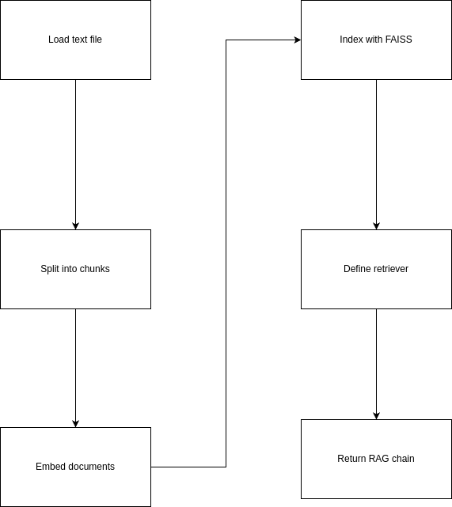

# Promtior Chatbot

This project implements a conversational assistant capable of answering questions about Promtior using a Retrieval-Augmented Generation (RAG) architecture. The knowledge source is a simple text file, and the entire solution (frontend + backend) is served from a single FastAPI application.

---

## Key Features

- Asynchronous backend using FastAPI
- RAG architecture powered by LangChain and OpenAI (GPT-3.5)
- Semantic search via FAISS
- Lightweight frontend using HTML, CSS, and vanilla JavaScript
- Fully modularized project structure
- Production-ready Dockerfile
- Deployable on Railway (or any Docker-compatible environment)

---

## Getting Started Locally

### 1. Clone the repository

```bash
git clone https://github.com/rodriaguillon/chatbot.git
cd chatbot
````

### 2. Install dependencies

Requires Python 3.10+

```bash
pip install --no-cache-dir -r requirements.txt
```

### 3. Create a `.env` file

```env
OPENAI_API_KEY=your_openai_api_key_here
```

### 4. Run the server

```bash
uvicorn app.main:app --reload
```

### 5. Open in browser

Visit: [http://localhost:8000](http://localhost:8000)

---

## Project Structure

```
app/
├── main.py              # FastAPI entry point and routing
├── config.py            # CORS and environment settings
├── rag_chain.py         # RAG chain construction logic
├── handlers.py          # Chat logic and validation
├── middlewares.py       # Global error handling
├── routes.py            # Static routes and frontend
frontend/
└── index.html           # User interface
data/
└── promtior_content.txt # Knowledge source
Dockerfile
requirements.txt
```

---

## Backend Process Flow

The full logic of how the backend builds and executes the RAG chain is illustrated below:



---

## Technical Documentation

A detailed description of the architecture, design decisions, and implementation challenges is available in [`documentation.md`](doc/documentation.md).
